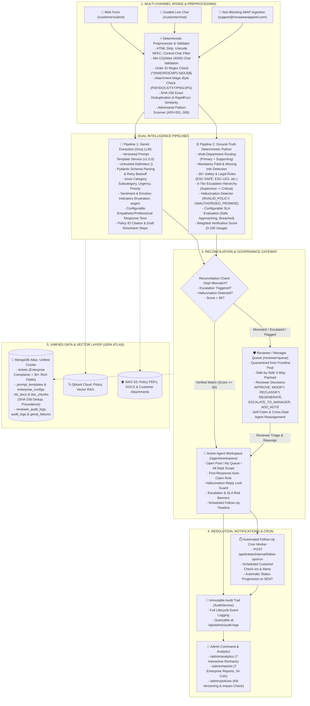
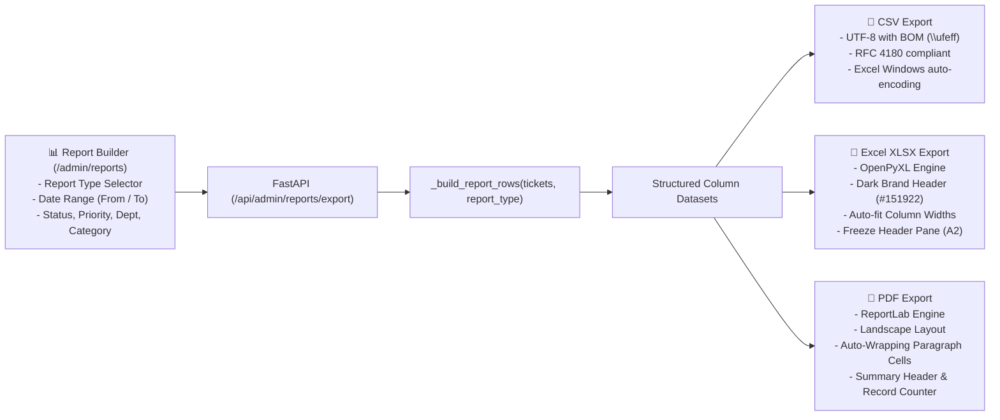

# 🌟 NovaWear Apparel — Complaint Intelligence & Resolution Platform
## 📋 Comprehensive System Architecture, Completed Modules & Operational Workflow Guide (`WORKFLOW.md`)

> **Date:** September 2026  
> **Platform Version:** 2.0.0 Enterprise Production  
> **Primary Domain / Rebrand:** NovaWear Apparel (`support@novawearapparel.com` / `support@novawearapparel.ai`)  
> **Production Deployment:** Vercel App (`https://novawear-apparel.vercel.app`)  
> **Stack:** Next.js 14 (App Router) + Dark Theme Design System | FastAPI (Python 3.10+) | MongoDB Atlas (Motor Async — Unified Core DB) | Qdrant Cloud RAG | Groq LLM (Llama-3.3-70b-versatile) | AWS S3 | OpenPyXL | ReportLab | RapidFuzz | python-docx | Pytest Engine

---

## 📌 Executive Summary


**NovaWear Apparel Complaint Intelligence Platform (SupportNova)** is an enterprise-grade dual-pipeline complaints intelligence and triage system. It reconciles probabilistic generative AI extraction (Pipeline 1) with strict, deterministic Python ground-truth compliance rules (Pipeline 2). This architecture eliminates LLM hallucinations, enforces corporate warranty and refund policies, detects missing submission data, computes 0–100 verification confidence scores, routes multi-department complaints, enforces 6-tier safety/legal escalation hierarchies, and provides frontline agents, judicial reviewers, department managers, and administrators with 360° operational visibility and immutable auditability.

The persistence and transactional audit tier is **100% unified on MongoDB Atlas (Motor Async)** with automated compound indexing, semver versioned prompts, configurable enterprise rule matrixes, and a fully passing **39/39 automated test suite**.

---

## 🏗️ High-Level System Architecture



---

## 🔄 End-to-End Workflow Stages

### Stage 1: Multi-Channel Intake & Strict Input Validation

The platform ingests complaints across three primary channels with pre-LLM deterministic validation:

1. **Web Intake Form (`/customer/submit`):**
   - Clean, validated input form bound to the authenticated customer's session.
   - Prevents empty or fragmented inputs via client and server validation.
2. **Interactive Guided Chat (`/customer/chat`):**
   - Real-time conversational intake with dynamic category prompt chips (`Delivery Delay`, `Defective Stitching`, `Sizing Mismatch`, `Return & Refund`).
   - Automatically gathers order IDs and descriptions before ticket finalization.
3. **Non-Blocking IMAP Ingestion Engine (`email_ingestion.py`):**
   - Ingests emails sent to `support@novawearapparel.com`.
   - **Non-Blocking:** Synchronous IMAP network calls are offloaded using `asyncio.to_thread` with a 10s timeout, preserving the responsiveness of FastAPI's async event loop.
   - **Deduplication:** Enforces unique MongoDB indexes on `Message-ID` to block duplicate ingestion.
   - **Auto-Acknowledgement:** Dispatches an automated branded confirmation email with tracking ID.

#### Preprocessing & Validation Gateway (`validate_and_preprocess_complaint`)
Before passing complaint data to any LLM or rule engine:
- **Sanitization:** HTML tags are stripped via regex, Unicode text is normalized via **NFKC**, and non-printable control characters are removed.
- **Length Bounds:** Description must satisfy `min_description_length` (default **15** characters) and is capped at `max_description_length` (**4000** characters). Short or empty complaints return a structured HTTP 400 error.
- **Order ID Regex Verification:** Validates order reference formats (`r"^(NW|ORD|CMP)-\d{4,8}$"`). Invalid patterns are flagged without crashing ingestion.
- **Metadata Extraction:** Deterministic regex scans extract embedded dates, monetary figures (`$\d+`), and order references.
- **Exact & Near-Duplicate Detection:**
  - Computes a deterministic SHA-256 content hash: `sha256(title:description:customer_id:order_id)`.
  - Searches prior complaints using **RapidFuzz** token set matching (threshold ≥85%) and **Jaccard** word similarity (threshold ≥0.60).
  - Sets `is_repeat=True`, calculates `repeat_count`, and links `related_ticket_ids`.
- **Attachment Validation:** Verifies magic bytes for allowed MIME types (`.pdf`, `.docx`, `.txt`, `.png`, `.jpg`). Unsupported or corrupted binaries are rejected at the gateway.

---

### Stage 2: Dual-Pipeline Evaluation (GenAI + Deterministic Python)

#### A. Pipeline 1: Resilient Generative AI (`groq_client.py` & `PromptService`)
* **Prompt Versioning:** The `PromptService` retrieves version-controlled system prompt templates (`v1.0.0`) from the `prompt_templates` MongoDB collection.
* **Prompt Injection Defense:** Untrusted user text is strictly enclosed within `<untrusted_complaint_text>` XML delimiters.
* **Resilience:** Employs exponential backoff retry (up to 3 attempts). Unrecoverable failures are logged to `genai_failures`.
* **Structured Output Schema:** Enforces strict Pydantic JSON parsing producing:
  - `complaint_id`, `issue_category`, `subcategory`, `sentiment` (`Positive`, `Neutral`, `Negative`, `Urgent`).
  - **Emotion Indicators:** Extracted emotional states (`frustration`, `disappointment`, `anger`, `urgency`, `relief`).
  - **Configurable Response Tone:** Calibrates generated draft responses to be empathetic, professional, and directly actionable.
  - `urgency`, `priority`, `department`, `policy_id`, `resolution_steps`, `suggested_response`.
* **Per-Analysis Metadata Logging (`analysis_meta`):**
  Every processed ticket stores complete analysis lineage:
  - `prompt_versions`: Exact prompt template name and semver version (e.g. `{"pipeline1_complaint_analysis": "v1.0.0"}`).
  - `genai_provider`: `"groq"`.
  - `model`: `"llama-3.3-70b-versatile"`.
  - `analyzed_at`: UTC timestamp.
  - `policy_versions_used`: Active policy IDs and version tags injected into the LLM context.

#### B. Pipeline 2: Deterministic Ground-Truth Engine (`ComplaintIntelligenceService`)
* **Zero LLM Dependency:** Runs pure Python logic using seeded enterprise configurations (`ConfigService`).
* **Multi-Department Routing:** Evaluates primary vs. supporting departments (e.g. Primary: `Quality Assurance`, Supporting: `Logistics`, `Billing`).
* **Mandatory Field & Missing Info Detection:** Evaluates 11 category required-field rules with alias support (e.g. "Returns & Refunds", "Product Quality & Defects"). Automatically generates specific clarification questions (e.g. "Please provide item SKU and photos of defective stitching").
* **30+ Safety, Legal & Financial Escalation Rules:** Evaluates deterministic trigger patterns.
* **Hallucination & Unauthorized Promise Detection:**
  - `INVALID_POLICY_CITATION`: Validates cited policy IDs against active documents in `kb_docs` or `DEFAULT_KNOWN_POLICIES`.
  - `UNAUTHORIZED_PROMISE`: Flags unverified commitments (e.g. unauthorized full cash refunds outside 30-day window, free replacement vouchers, untraceable dollar compensations).
* **Configurable SLA Risk Evaluation:** Evaluates elapsed time against priority targets (P0: 2h response/4h resolution; P1: 4h/8h; P2: 8h/24h; P3: 24h/72h). Classifies tickets as:
  - `"safe"`: Under 75% elapsed.
  - `"approaching"`: ≥75% of resolution target elapsed.
  - `"breached"`: Resolution target exceeded.
* **Weighted Verification Score (0–100):**
  $$\text{Score} = w_{\text{dept}} S_{\text{dept}} + w_{\text{cat}} S_{\text{cat}} + w_{\text{pol}} S_{\text{pol}} + w_{\text{esc}} S_{\text{esc}} - \text{Penalties}$$
  Deducts penalties for department mismatches (-30), hallucinated citations (-25), unauthorized promises (-20), and adversarial triggers (-40).

---

### Stage 3: Escalation Hierarchy (6 Enterprise Levels)

When Pipeline 2 triggers an escalation rule, the ticket is assigned one of **6 explicit escalation tiers** and routed accordingly:

| Level | Tier Identifier | Typical Triggers | Target Authority | Routing & SLA Action |
|---|---|---|---|---|
| **L1** | `SUPERVISOR_REVIEW` | Repeat complaint count ≥2, VIP Tier-1 customer retention risk, courier theft allegation, agent misconduct | Frontline Shift Supervisor | Quarantined to Reviewer Queue; Supervisor notification |
| **L2** | `DEPARTMENT_MANAGER` | High-value monetary dispute (>$500), wedding/funeral delivery failure, influencer viral threat, medical emergency policy exception | Department Head / Operations Manager | 4-hour SLA target; Manager review badge |
| **L3** | `SPECIALIST_TEAM` | Account credential hack, stolen credit card, payment fraud, suspicious chargeback | IT Security / Fraud Investigation Team | Specialized investigation lock; Agent reply disabled |
| **L4** | `COMPLIANCE_REVIEW` | Attorney representation letter, small claims lawsuit threat, regulatory complaint (FTC, BBB, AG), statutory GDPR/CCPA data deletion | Legal & Regulatory Compliance Counsel | Status forced to `AI Review`; Legal review lock |
| **L5** | `CRITICAL_MANAGEMENT` | Active data breach / SSN leak allegation, investigative press / media inquiry, severe personal injury (staples/glass) | Executive Committee / VP Customer Experience | Instant P0 Critical priority; 2-hour executive SLA |
| **L6** | `STANDARD` / `NONE` | Standard return, polite inquiry, sizing exchange within policy limits | Standard Frontline Agent Pool | Direct routing to active agent queue |

---

### Stage 4: Reviewer Governance & Manual Queue (`/reviewer/queue`)

Tickets flagged with `department_mismatch=true`, `match_status=false`, `status="AI Review"`, or active hallucination flags are quarantined from frontline agents.

#### Reviewer Decision Suite (`routers/reviewer.py`)
Reviewers and Managers have company-wide access (`DEP-ALL`) and can execute 6 distinct decisions:
1. **`APPROVE`:** Accepts the AI draft response and releases the ticket to the agent pool or dispatches it directly.
2. **`MODIFY`:** Directly edits the AI response, priority, or category before approving.
3. **`RECLASSIFY`:** Reassigns category, subcategory, or active department.
4. **`REGENERATE`:** Sends critique feedback back to Groq GenAI for a fresh draft response.
5. **`ESCALATE_TO_MANAGER`:** Elevates high-risk P0 tickets directly to department leadership.
6. **`ADD_INTERNAL_NOTE`:** Records internal audit notes without affecting customer-facing draft text.

#### Triage & Cross-Department Reassignment
* **Claiming (`POST /api/reviewer/tickets/{id}/claim`):** Reviewers self-assign quarantined tickets.
* **Transfer (`POST /api/reviewer/tickets/{id}/assign-reviewer`):** Reassigns tickets between reviewers with audit justification.
* **Agent Assignment (`POST /api/tickets/{id}/reassign`):** Reviewers assign the ticket to an active agent across departments. Clears the mismatch flag, updates the ticket's active department, sets status to `"In Progress"`, and dispatches an automated notification email to the assigned agent.

---

### Stage 5: Frontline Agent Workspace (`/agent/workspace`)

1. **Queue Scope Filtering:**
   - `ALL_DEPT`: Displays tickets across the agent's department + tickets assigned to them.
   - `MY_QUEUE`: Shows only tickets explicitly assigned to this agent.
   - `UNASSIGNED`: Displays open, unclaimed pool tickets.
2. **Reviewer Assignment Bypass:**
   - Tickets assigned directly by a Reviewer or Manager bypass mismatch locks and appear in the agent's active queue with a `✅ REVIEWER TRIAGED & ASSIGNED` banner.
3. **First-Response Auto-Claim:**
   - An agent's first response on an unassigned ticket claims and locks it to that agent with full audit trail logging.
4. **Hallucination Reply Lock Guard:**
   - The "Send Email Reply" button is disabled if `hallucination_flags.length > 0`, displaying `⛔ Reply blocked: AI hallucination flags detected. Contact reviewer.`
5. **Integrated Visual Banners:**
   - Escalation Banner (`EscalationBanner.jsx`): Displays danger alert with level-specific styling (L1–L5).
   - SLA Risk Banner (`SlaRiskBadge.jsx`): Displays warnings for `approaching` and `breached` tickets.
   - AI Pipeline Dossier (`ComplaintSummary.jsx`) & Department Routing (`DeptRouting.jsx`).

---

### Stage 6: Scheduled Follow-Up Engine & Cron Worker

1. **Schedule Generation (`generate_follow_up_schedules`):**
   - Automatically computes future follow-up checkpoints based on issue category:
     - Delivery delay: Check-in scheduled at +24h.
     - Defective replacement: Delivery check scheduled at +72h.
     - Refund processing: Banking settlement check scheduled at +120h.
2. **Follow-Up Timeline UI (`FollowUpTimeline.jsx`):**
   - Renders a 5-step vertical lifecycle timeline with status-driven active, pulsing, and completed nodes.
3. **Automated Background Runner (`POST /api/tickets/internal/follow-ups/run`):**
   - Background worker / serverless cron endpoint that scans for scheduled follow-ups where `status == "SCHEDULED"` and `scheduled_at <= datetime.utcnow()`.
   - Dispatches check-in emails to customers.
   - Transitions follow-up item status to `"SENT"`.
   - Records immutable `FOLLOW_UP_SENT` events in `AuditService`.
4. **Agent / Reviewer Management (`PATCH /api/tickets/{id}/follow-ups/{fid}`):**
   - Allows agents and reviewers to edit scheduled messages or mark items as `CANCELLED`.

---

### Stage 7: Knowledge Base, Policy Governance & DOCX Engine (`/admin/policies`)

* **Multi-Format Ingestion:** Ingests **PDF**, **DOCX**, and **TXT/MD** policy manuals.
* **DOCX Parsing & Memory Streaming (`DocumentExtractor`):**
  - Uses `python-docx` to parse paragraph text and headings directly from memory streams (`io.BytesIO`).
  - Segments documents into structured chunks based on heading styles and section breaks.
* **Enriched Chunk Metadata (`DocChunk`):**
  Every extracted chunk is indexed with full enterprise metadata:
  - `doc_id` (e.g. `DEL-POL-04`)
  - `section_id` (e.g. `DEL-POL-04-SEC-002`)
  - `title` & `heading`
  - `page_number`
  - `content`
  - `version` (e.g. `v1.2`)
  - `category` (validated against active category taxonomy)
  - `effective_date` & `expiry_date`
  - `status` (`ACTIVE`, `SUPERSEDED`, `DRAFT`, `EXPIRED`, `ARCHIVED`)
* **Security & Integrity Checks:**
  - Magic bytes inspection (`%PDF`, `PK\x03\x04` ZIP header for DOCX, UTF-8 for TXT).
  - SHA-256 deduplication rejects duplicate file uploads.
  - Pre-upload adversarial scanner flags policy documents containing prompt injection strings.
* **Version Control & Auto-Superseding:**
  - Uploading a new active version of an existing document marks prior versions as `SUPERSEDED`, links `superseded_by` pointers, and logs `DOCUMENT_SUPERSEDED` in `AuditService`.
* **Policy Impact Check Endpoint (`POST /api/policies/{id}/impact-check`):**
  - Simulates the operational impact of a policy revision, returning all open tickets citing the modified policy.

---

### Stage 8: Reports Engine & Multi-Format Export (`/admin/reports`)

The reports subsystem supports **7 enterprise report types** exported via streaming API (`GET /api/admin/reports/export?report_type=...&format=csv|xlsx|pdf`):



#### The 7 Enterprise Report Types
1. **`complaint_analysis` (Comprehensive 34 Columns):**
   - *Original 27 Columns:* Ticket ID, Created At, Customer Name, Customer Email, Order ID, Channel, Complaint Title, Description, Customer Dept, Active Dept, Category, Subcategory, Priority, Urgency, Sentiment, Status, Match Status, Assigned Agent, Agent Email, Reviewer/Manager, Policy ID, Escalation Status, SLA Breach, Agent Notes, Draft Response, Resolution Steps, Updated At.
   - *7 Enterprise Extension Columns:* Secondary Issues, Supporting Departments, Verification Score, Escalation Level, Repeat Complaint (YES/NO), Missing Fields, Hallucination Flags Count.
2. **`genai_python_comparison` (14 Columns):**
   - Side-by-side comparison of GenAI vs Python outputs: GenAI Dept vs Python Dept, Dept Match, GenAI Priority vs Python Priority, Priority Match, GenAI Escalation vs Python Escalation, Escalation Match, Verification Score, Final Routing Decision.
3. **`escalations` (12 Columns):**
   - Audit of all escalated complaints: Ticket ID, Customer, Category, Department, Priority, Escalation Level (L1–L5), Escalation Source, Triggered Rules, Status, Assigned Agent, Assigned Reviewer.
4. **`sla_status` (9 Columns):**
   - Operational SLA compliance: Ticket ID, Priority, Status, SLA Status (`safe`, `approaching`, `breached`), Hours Remaining, SLA Risk %, Department, Assigned Agent.
5. **`policy_usage` (9 Columns):**
   - Citation metrics: Ticket ID, Policy ID, Category, Department, Match Status, Hallucination Citation Validity (`YES (Invalid)` / `NO (Valid)`), Handling Agent, Status.
6. **`resolution_compliance` (10 Columns):**
   - Resolution quality audit: Ticket ID, Category, Priority, Status, SLA Breach, Verification Score, Policy Compliant, Actions Completed, Assigned Agent.
7. **`manual_reviews` (9 Columns):**
   - Reviewer queue actions: Ticket ID, Mismatch Reason, Original Dept, Assigned Dept, Reviewer Name, Status, Reviewer Action Taken (`REASSIGNED`, `IN_REVIEW`, `PENDING_CLAIM`), Reassigned Agent.

---

### Stage 9: Analytics, Trends & Defect Detection (`/admin/analytics`)

* **MongoDB `$facet` Aggregation (`GET /api/admin/analytics/summary`):**
  - High-performance single-pass calculation of volume distributions, sentiment, department workloads, escalation rates, average resolution times, and verification scores.
* **Time-Series Trends Endpoint (`GET /api/admin/analytics/trends?range=7d|30d|90d`):**
  - Powers 7 interactive Recharts visualizers in `/admin/analytics`:
    1. Complaint Volume Trend (AreaChart)
    2. Category Distribution (Donut / PieChart)
    3. Sentiment Distribution (Horizontal BarChart)
    4. Safety & Legal Escalation Trend (LineChart)
    5. SLA Risk & Breach Trend (Stacked BarChart)
    6. Repeat Customer Complaint Rate (LineChart)
    7. AI Verification Accuracy & Match Ratio (AreaChart)
* **Automated Operational Alerts (`GET /api/admin/analytics/alerts`):**
  - Volume Spike Alert: Triggered when daily volume increases by >30% (min 5 tickets).
  - Recurring Defect Alert: Triggered when ≥3 complaints cite the same category/product defect within 48 hours.
  - Escalation Spike: Triggered when safety/legal escalations exceed 20% of intake.
  - Pipeline Mismatch Surge: Triggered when GenAI vs Python divergence exceeds 25%.

---

### Stage 10: Customer Portal & Dashboard (`/customer/dashboard`)

* **Ticket Management Table:**
  - Displays customer complaints with live status pills, `IssueBadges` (primary + secondary issue tags), and `RepeatBadge` indicators.
* **Customer Ticket Detail Drawer:**
  - **`ComplaintSummary.jsx` (Customer Variant):** Clean overview of complaint status, category, sentiment, and estimated resolution time.
  - **`ClarificationCard.jsx`:** Renders pending AI-generated clarification questions. Allows customers to submit direct answers (`POST /api/tickets/{id}/clarifications/answer`), which re-evaluates missing fields and notifies handling agents.
  - **`FollowUpTimeline.jsx`:** Displays active lifecycle progress.
  - **`DeptRouting.jsx`:** Shows assigned department ownership.

---

### Stage 11: Security, Auth & Real-Time Sync

* **Dynamic Social Google OAuth (Customers):**
  - Uses `x-forwarded-host` and `host` headers to construct redirect URIs dynamically.
  - Automatically redirects to production domain (`https://novawear-apparel.vercel.app/customer/dashboard`) when deployed, preventing localhost fallbacks.
* **Strict Staff Authentication (RBAC):**
  - 5 Protected Roles: `CUSTOMER`, `AGENT`, `REVIEWER`, `MANAGER`, `ADMIN`.
  - Staff members authenticate exclusively via email/password credentials with bcrypt encryption and JWT verification.
* **Zero-Reload WebSocket Synchronization (`useWebSocket.js`):**
  - Bi-directional WebSocket connection broadcasts events:
    - `TICKET_CREATED`: Updates agent and reviewer queues instantly.
    - `TICKET_UPDATED`: Refreshes status, follow-up timelines, and notes.
    - `AGENT_REASSIGNED`: Moves tickets between agent queues without page reloads.
    - `REVIEWER_CLAIMED`: Updates claim indicators.
    - `REFRESH_DATA`: Triggers silent background data refetching.
* **Targeted Rate Limiter (5 Minutes):**
  - Locks out abusive clients targeting `(IP, Email)` tuples after repeated invalid attempts, protecting standard users.

---

## 🎨 Complete Dark Theme Token System

All 21 App Router pages use semantic CSS custom properties defined in `globals.css`:

```css
:root {
  /* Background Surfaces */
  --nw-base:      #0B0E14;  /* Deep body background */
  --nw-surface:   #151922;  /* Cards, tables, sidebar */
  --nw-elevated:  #1D2230;  /* Modals, inputs, dropdowns */
  --nw-overlay:   rgba(11,14,20,0.78);

  /* Borders & Focus */
  --nw-border:        rgba(255,255,255,0.07);
  --nw-border-strong: rgba(255,255,255,0.13);
  --nw-focus-ring:    rgba(201,111,74,0.45);

  /* Typography */
  --nw-text-primary:   #F2EFEA;
  --nw-text-secondary: #B8B5AE;
  --nw-text-muted:     #9A9CA5;
  --nw-text-inverse:   #0B0E14;

  /* Brand Accents */
  --nw-accent:       #C96F4A;  /* Burnt Terracotta — Primary CTA */
  --nw-accent-dim:   rgba(201,111,74,0.15);
  --nw-gold:         #C9A227;  /* Sage Gold — Headings / Reviewer */
  --nw-gold-dim:     rgba(201,162,39,0.13);

  /* Role Distinctions */
  --role-customer: #C96F4A;
  --role-agent:    #4FA689;
  --role-reviewer: #C9A227;
  --role-admin:    #C1495B;
}
```

### Complete Reusable Micro-Components Library (`/client/app/components/`)
1. **`Logo.jsx`:** Stitched N monogram SVG with gold-to-terracotta gradient, dashed thread stroke (`stroke-dasharray="4.2 2.8"`), and circuit-spark tip.
2. **`VerificationScore.jsx`:** 180° SVG arc gauge with green (≥80), gold (60–79), and red (<60) zones.
3. **`ComplaintSummary.jsx`:** Dual-variant dossier (`customer` vs `agent`) with sentiment, category, and draft preview.
4. **`IssueBadges.jsx`:** Filled primary issue badge + outlined secondary issue tags.
5. **`RepeatBadge.jsx`:** Warning-colored repeat customer pill with previous ticket link and count.
6. **`DeptRouting.jsx`:** Primary and supporting department routing display.
7. **`FollowUpTimeline.jsx`:** Vertical lifecycle timeline with active/pulsing/completed nodes.
8. **`ClarificationCard.jsx`:** Interactive customer clarification QA component.
9. **`EscalationBanner.jsx`:** Prominent safety/legal escalation banner with L1–L5 level colors.
10. **`SlaRiskBadge.jsx`:** Inline badge indicating `safe`, `approaching`, or `breached` SLA status.

---

## 🧪 Automated Test Suite (39/39 Passing)

The test suite validates both unit components and full golden integration scenarios:

```bash
pytest tests -v
```

```
tests/integration/test_pipeline_override.py::test_python_escalation_rule_overrides_genai_no_escalation PASSED [  2%]
tests/integration/test_scenarios.py::test_scenario_1_angry_but_low_risk PASSED                         [  5%]
tests/integration/test_scenarios.py::test_scenario_2_calm_but_safety_critical PASSED                  [  7%]
tests/integration/test_scenarios.py::test_scenario_3_prompt_injection PASSED                          [ 10%]
tests/integration/test_scenarios.py::test_scenario_4_unsupported_refund PASSED                          [ 12%]
tests/integration/test_scenarios.py::test_scenario_5_missing_order_id PASSED                          [ 15%]
tests/integration/test_scenarios.py::test_scenario_6_three_issue_complaint PASSED                      [ 17%]
tests/integration/test_scenarios.py::test_scenario_7_repeat_complaint_different_wording PASSED         [ 20%]
tests/integration/test_scenarios.py::test_scenario_8_superseded_policy_citation PASSED                 [ 23%]
tests/unit/test_adversarial.py (4 tests)                                                               PASSED [ 33%]
tests/unit/test_duplicates.py (3 tests)                                                                PASSED [ 41%]
tests/unit/test_escalation_rules.py (5 tests)                                                          PASSED [ 53%]
tests/unit/test_follow_ups.py (1 test)                                                                 PASSED [ 56%]
tests/unit/test_hallucinations.py (5 tests)                                                            PASSED [ 69%]
tests/unit/test_missing_info.py (5 tests)                                                              PASSED [ 82%]
tests/unit/test_multi_dept_routing.py (2 tests)                                                        PASSED [ 87%]
tests/unit/test_policy_applicability.py (3 tests)                                                      PASSED [ 94%]
tests/unit/test_verification_score.py (2 tests)                                                        PASSED [100%]

======================= 39 passed in 1.81s ========================
```

---

## 🗺️ Master API Endpoints Directory

### 1. Complaint Intake & Clarifications (`ticket_routes.py`)
* `POST /api/tickets/submit` — Multi-pipeline complaint intake.
* `GET /api/tickets` — List complaint tickets with queue, department, and role scopes.
* `GET /api/tickets/{id}/clarifications` — Retrieves clarification questions for customer.
* `POST /api/tickets/{id}/clarifications/answer` — Customer answers clarification questions.
* `GET /api/tickets/{id}/follow-ups` — Retrieves scheduled follow-up timeline.
* `PATCH /api/tickets/{id}/follow-ups/{fid}` — Agent/Reviewer edits or cancels scheduled follow-up.
* `POST /api/tickets/internal/follow-ups/run` — Automated cron endpoint to dispatch due follow-up emails.
* `GET /api/tickets/{id}/history` — Full ticket audit and reassignment history.
* `GET /api/tickets/{id}/escalation-notes` — Retrieves escalation level and triggered rule notes.
* `PUT /api/tickets/{id}/status` — Status transition (`In Progress`, `Resolved`, `Closed`); triggers auto-claim.

### 2. Reviewer Workspace & Audit (`routers/reviewer.py`)
* `GET /api/reviewer/queue` — Retrieves tickets quarantined in manual review queue.
* `GET /api/reviewer/tickets/{id}` — 3-way side-by-side payload (Customer, GenAI, Python Rule).
* `POST /api/reviewer/tickets/{id}/action` — Executes reviewer decision (`APPROVE`, `MODIFY`, `RECLASSIFY`, `REGENERATE`, `ESCALATE_TO_MANAGER`, `ADD_INTERNAL_NOTE`).
* `POST /api/reviewer/tickets/{id}/claim` — Self-assigns review ticket.
* `POST /api/reviewer/tickets/{id}/assign-reviewer` — Transfers ticket to peer reviewer.
* `POST /api/tickets/{id}/reassign` — Reassigns ticket to frontline agent, resolving mismatch flag.

### 3. Policy & Knowledge Base Management (`policy_routes.py`)
* `GET /api/policies` — Lists all policy documents with search and department filtering.
* `POST /api/policies/upload` — Ingests PDF, DOCX, TXT with SHA-256 dedup, magic bytes check, and auto-superseding.
* `GET /api/policies/{id}/versions` — Retrieves version lineage of a policy document.
* `PATCH /api/policies/{id}/status` — Updates policy lifecycle status (`ACTIVE`, `SUPERSEDED`, `DRAFT`, `ARCHIVED`).
* `POST /api/policies/{id}/impact-check` — Simulates open tickets affected by policy revisions.

### 4. Admin Command, Analytics & Reports (`admin_routes.py`)
* `GET /api/admin/analytics/summary` — Full MongoDB `$facet` aggregation metrics.
* `GET /api/admin/analytics/trends` — Time-series trend data for Recharts (7d/30d/90d).
* `GET /api/admin/analytics/alerts` — Automated operational anomaly and defect alerts.
* `GET /api/admin/reports/preview` — Previews records for any of the 7 report types.
* `GET /api/admin/reports/export` — Streams report export in CSV, XLSX, or PDF format.
* `GET /api/admin/audit-logs` — Centralized audit trail with event and actor filters.
* `GET /api/admin/users` — Staff roster with role and department assignments.
* `POST /api/admin/create-staff` & `POST /api/admin/update-staff` — Staff credential & role CRUD.

---

## 🚀 How to Run the Entire Platform Locally

### 1. Database & Seeding Migration
```bash
# Execute idempotent compound index creation & baseline seeding
python server/scripts/migrate_enterprise_v2.py
```

### 2. Run Test Suite
```bash
pytest tests -v
```

### 3. Backend FastAPI Server
```bash
cd server
python -m uvicorn app:app --host 0.0.0.0 --port 8000 --reload
```
* **API Documentation (Swagger UI):** `http://localhost:8000/docs`
* **Health Check:** `http://localhost:8000/health`

### 4. Frontend Next.js Client
```bash
cd client
npm run dev
```
* **App URL:** `http://localhost:3000`
* **Admin Analytics:** `http://localhost:3000/admin/analytics`
* **Reports Builder:** `http://localhost:3000/admin/reports`
* **Reviewer Queue:** `http://localhost:3000/reviewer/queue`
* **Agent Workspace:** `http://localhost:3000/agent/workspace`
* **Customer Dashboard:** `http://localhost:3000/customer/dashboard`
* **Verify Production Build:** `npm run build` (21/21 static & dynamic pages compiled with 0 errors)
